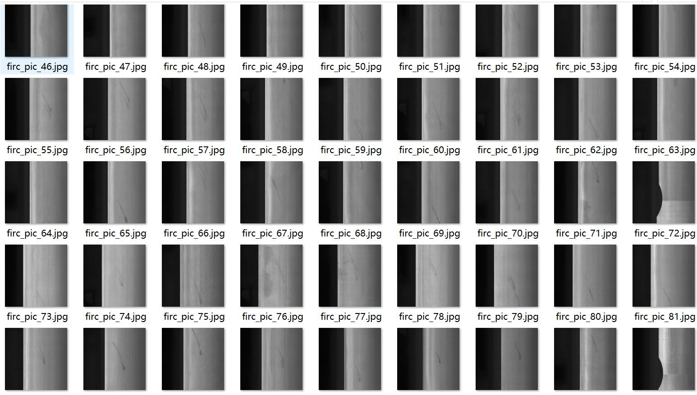
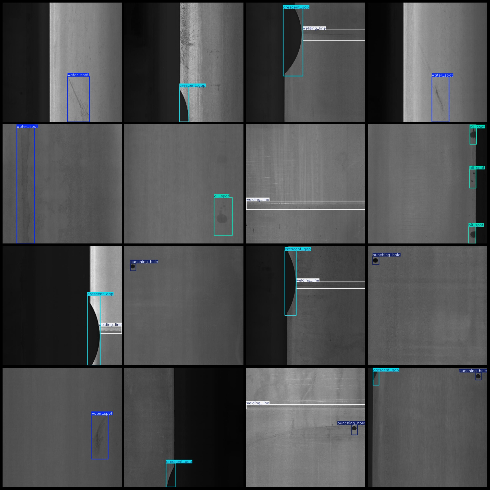
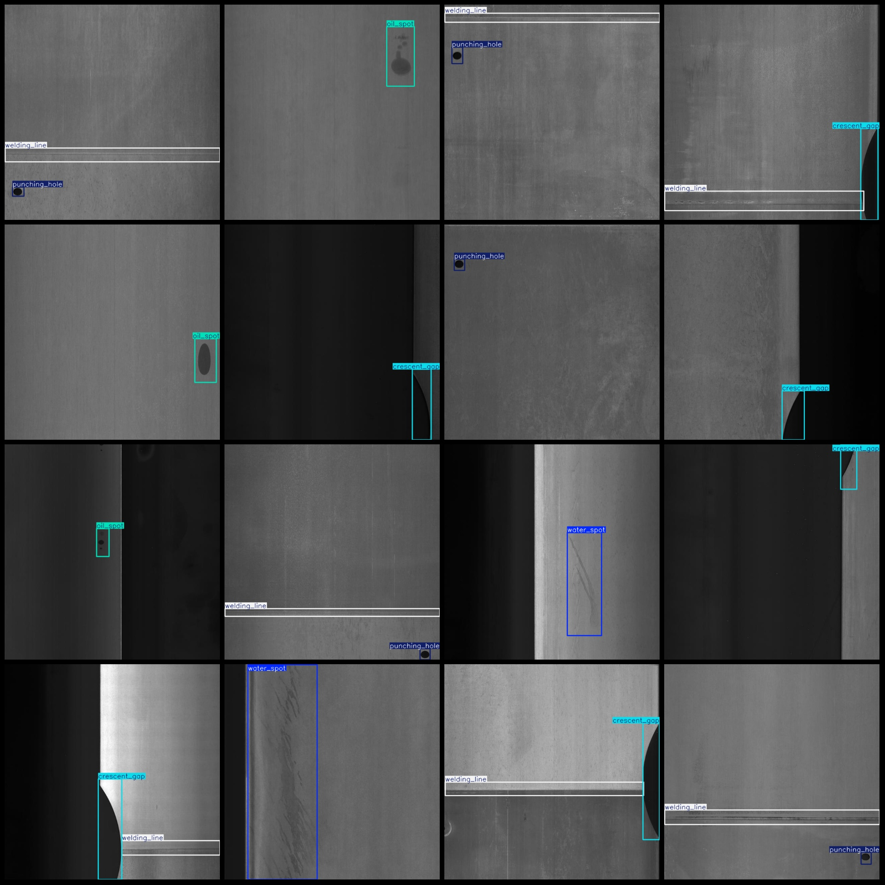

# Steel Surface Defect Detection Dataset: VOC+YOLO Format, 1196 Images in 5 Categories

Dataset formats: Pascal VOC format + YOLO format (txt files without segmentation paths, only containing jpg images along with corresponding VOC format xml files and YOLO format txt files).
Number of images (jpg file count): 1196
Number of annotations (xml file count): 1196
Number of annotations (txt file count): 1196
Number of categories: 5
Annotation category names (note that the order of categories in the YOLO format may not correspond to this, but refer to the "labels" folder's "classes.txt" for reference): ["crescent_gap", 
"oil_spot", "punching_hole", "water_spot", "welding_line"]
Number of boxes per category:
- crescent_gap (crescent shape gap) number of boxes = 313, occupied images = 312
- oil_spot (Oil spot) number of boxes = 344, occupied images = 218
- punching_hole (Punching hole) number of boxes = 345, occupied images = 340
- water_spot (Water spot) number of boxes = 355, occupied images = 295
- welding_line (Welding line) number of boxes = 518, occupied images = 516
Total boxes: 1875
Image resolution: 640x640
Annotation tool used: labelImg
Annotation rules: draw bounding box around the category
Important note: The dataset does not have separate training, validation, or test sets; they need to be manually divided.
Special declaration: This dataset does not guarantee any accuracy of the trained models or weight files.
Image preview:

## Images

Here is a pay link on Stripe ( https://buy.stripe.com/3cs8yP7sY87d0vu9AB ). Please contact me lonlonago@foxmail.com after funding $89, and I will send you a complete data files , thank you!

